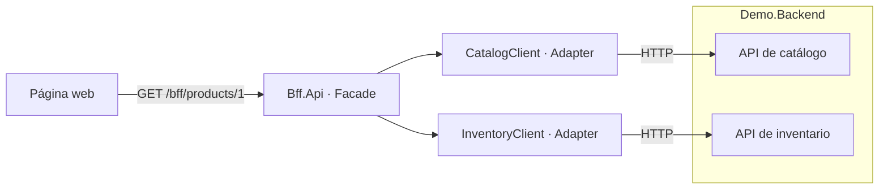

# Ejemplo simple de BFF en .NET 10

Un **Backend for Frontend (BFF)** prepara una API para las necesidades de una interfaz concreta. En este ejemplo, la página web hace una sola petición para obtener nombre, precio y disponibilidad. El BFF consulta catálogo e inventario por HTTP y transforma las respuestas al modelo de la pantalla.

## Arquitectura



Las dos APIs simuladas viven en `Demo.Backend` para ejecutar el ejemplo con solo dos procesos. Sus URLs se configuran por separado: puedes sustituirlas por servicios reales sin cambiar la fachada. Los dos proyectos no se referencian entre sí; se comunican por HTTP.

## Ejecutar

Requisito: SDK de .NET 10. Las aplicaciones no requieren base de datos ni paquetes NuGet adicionales. Los proyectos de pruebas usan MSTest.Sdk, Moq y Microsoft.AspNetCore.Mvc.Testing; la suite de aserciones fluidas añade FluentAssertions 7.2.0. `NuGet.Config` configura nuget.org para restaurar estos paquetes. La primera restauración requiere conexión si no están en la caché local.

Desde la carpeta raíz, compila:

```powershell
dotnet restore BffExample.slnx --configfile NuGet.Config
dotnet build BffExample.slnx --no-restore
```

En una terminal, inicia las APIs simuladas:

```powershell
dotnet run --project src/Demo.Backend --launch-profile http --no-restore
```

En otra terminal, inicia el BFF:

```powershell
dotnet run --project src/Bff.Api --launch-profile http --no-restore
```

Abre [la página de productos](http://localhost:5100). El backend escucha en `http://localhost:5101`. Detén cada proceso con `Ctrl+C`.

## Patrones utilizados

| Patrón o técnica | Archivo | Función |
| --- | --- | --- |
| BFF | `Bff.Api` | Ofrece un contrato específico para esta pantalla web. |
| Facade | `Services/ProductPageService.cs` | Oculta la coordinación entre catálogo e inventario detrás de `GetAsync`. |
| Adapter | `Clients/CatalogClient.cs`, `Clients/InventoryClient.cs` | Convierte las APIs HTTP externas en interfaces C# para la fachada. |
| Agregación | `Services/ProductPageService.cs` | Ejecuta dos consultas en paralelo y compone una sola respuesta. |
| Inyección de dependencias | `Program.cs` | Conecta interfaces y clientes tipados gestionados por `IHttpClientFactory`. |
| DTO | `Models/ProductPageDto.cs` | Separa el contrato de la pantalla de los modelos internos de los backends. |

Para seguir el código, empieza por `ProductEndpoints`, continúa con `ProductPageService` y revisa los dos clientes HTTP. Las interfaces permiten sustituir los clientes por dobles en pruebas.

Cada clase, interfaz y `record` está en un archivo con su mismo nombre. Los `using` explícitos se declaran después del `namespace`, incluidos los dos `Program.cs`. Los modelos del backend están en `Demo.Backend/Models`.

Los archivos se agrupan por función en carpetas comunes:

```text
src/
├── Bff.Api/
│   ├── Clients/           # Adaptadores HTTP
│   ├── Configuration/     # Opciones de conexión
│   ├── Endpoints/         # Rutas del BFF
│   ├── ExceptionHandlers/ # Tratamiento de errores
│   ├── Interfaces/        # Contratos de clientes y servicios
│   ├── Models/            # Records y DTO
│   ├── Services/          # Fachada y agregación
│   ├── wwwroot/           # Página web
│   └── Program.cs
└── Demo.Backend/
    ├── Endpoints/         # APIs simuladas
    ├── Models/            # Records del backend
    └── Program.cs
```

Las pruebas están en `tests/Bff.Api.Tests` y `tests/Bff.Api.FluentTests`, agrupadas en `Services`, `Clients`, `Configuration`, `ExceptionHandlers`, `Integration` y `Mocks`.

La fachada adapta datos para la presentación; el catálogo conserva el precio y el inventario conserva las existencias. `CanBuy` indica disponibilidad visual en esta demo, no autoriza una compra ni reserva stock. `SupplierCost` es un dato interno simulado: llega desde catálogo, pero no se publica en el BFF.

## Por qué ProductPageService consulta en paralelo

En este BFF se mantienen las consultas a catálogo e inventario **en paralelo** porque ambas son independientes: solo necesitan el `id` recibido en la petición, y la pantalla necesita los dos resultados. Así se reduce el tiempo de respuesta.

```csharp
var productTask = catalogClient.GetProductAsync(id, cancellationToken);
var stockTask = inventoryClient.GetStockAsync(id, cancellationToken);

await Task.WhenAll(productTask, stockTask);
```

Las dos llamadas comienzan antes de esperar sus resultados. Si catálogo tarda 200 ms e inventario 300 ms, la comparación aproximada es:

| Ejecución | Tiempo de respuesta |
| --- | --- |
| Secuencial: primero catálogo, después inventario | 500 ms; los tiempos se suman. |
| En paralelo | 300 ms; domina la consulta más lenta. |

Estos tiempos son ilustrativos y no incluyen el trabajo adicional de composición y envío de la respuesta.

La contrapartida es que se consulta inventario incluso si el producto no existe. Con llamadas secuenciales se podría comprobar primero el 404 del catálogo y evitar esa segunda llamada.

La ejecución secuencial sería más adecuada si inventario necesitara un dato obtenido del catálogo, o si fueran frecuentes las consultas a productos inexistentes y se quisiera reducir las llamadas innecesarias al inventario. Para el funcionamiento actual, orientado a mostrar fichas de productos existentes, se mantiene la ejecución en paralelo.

## Probar la API

```powershell
Invoke-RestMethod http://localhost:5100/bff/products/1
```

Respuesta:

```json
{
  "id": 1,
  "name": "Portátil",
  "description": "Portátil de 14 pulgadas para trabajar y estudiar.",
  "price": 899.90,
  "displayPrice": "899,90 EUR",
  "availability": "Disponible",
  "canBuy": true
}
```

| Petición o situación | Resultado |
| --- | --- |
| `/bff/products/1` | 200, disponible. |
| `/bff/products/2` | 200, agotado; `canBuy` es `false`. |
| `/bff/products/999` | 404, producto inexistente. |
| `/bff/products/0` | 400, identificador inválido. |
| Backend detenido o respuesta inválida | 502. |
| Backend tarda más de 3 segundos | 504. |

Los errores usan `ProblemDetails`. Los detalles técnicos se registran en el servidor. La cancelación de la petición se propaga a las llamadas HTTP. La respuesta requiere las dos fuentes: si alguna falla, no se devuelve una ficha parcial, incluso si la otra devuelve un 404.

`/health` confirma que cada proceso responde; no comprueba sus dependencias.

## Verificación automática

### Pruebas de Bff.Api

Se conservan dos suites con los mismos 46 casos para comparar las aserciones:

| Proyecto | Aserciones | Ejecutor |
| --- | --- | --- |
| `Bff.Api.Tests` | `Assert` y `StringAssert` de `Microsoft.VisualStudio.TestTools.UnitTesting`. | MSTest con Microsoft.Testing.Platform. |
| `Bff.Api.FluentTests` | FluentAssertions: `Should().Be()`, `BeEquivalentTo()`, `ThrowAsync()` y `ThrowExactlyAsync()`. | MSTest con Microsoft.Testing.Platform. |

Las pruebas originales con UnitTesting se mantienen intactas. FluentAssertions cambia la sintaxis de las aserciones; MSTest sigue descubriendo y ejecutando las pruebas de ambas suites. Las dos mantienen `[TestMethod]`, los bloques Arrange/Act/Assert y los mocks estrictos.

```powershell
dotnet restore BffExample.slnx --configfile NuGet.Config
dotnet test --project tests/Bff.Api.Tests/Bff.Api.Tests.csproj --no-restore
dotnet test --project tests/Bff.Api.FluentTests/Bff.Api.FluentTests.csproj --no-restore
```

Para ejecutar las dos suites en una llamada:

```powershell
dotnet test --solution BffExample.slnx --no-restore
```

Por ejemplo, una aserción con UnitTesting:

```csharp
Assert.AreEqual(HttpStatusCode.OK, response.StatusCode);
```

En la suite con FluentAssertions:

```csharp
response.StatusCode.Should().Be(HttpStatusCode.OK);
```

Los dos proyectos usan **MSTest.Sdk con Microsoft.Testing.Platform**. `global.json` selecciona ese runner para `dotnet test` en .NET 10. Todas las pruebas llevan `[TestMethod]` y los bloques `// Arrange`, `// Act`, `// Assert`. `[DataRow]` permite ejecutar varios casos con el mismo método.

| Carpeta | Comportamientos comprobados |
| --- | --- |
| `Services` | Agregación de producto e inventario, precio para la pantalla, disponibilidad, producto inexistente, inventario ausente, errores, consultas en paralelo y propagación de cancelación. |
| `Clients` | Ruta HTTP, deserialización, 404, errores HTTP, JSON inválido, cuerpo JSON nulo y cancelación. |
| `Configuration` | URLs absolutas HTTP(S) y barra final obligatoria. |
| `ExceptionHandlers` | No escribir una respuesta de error cuando el cliente cancela la petición. |
| `Integration` | DTO público, exclusión de datos internos, 400/404/502/504/500 con ProblemDetails, inventario inconsistente, health y página HTML. |

**Las llamadas a `Demo.Backend` se resuelven con mocks de Moq, siempre con `MockBehavior.Strict`.** La fachada se prueba con mocks de `ICatalogClient` e `IInventoryClient`. Los clientes HTTP y las pruebas de integración usan un mock de `HttpMessageHandler`, con setups para el envío y la liberación del handler. Las pruebas de integración levantan el BFF en memoria con `WebApplicationFactory` y ejecutan los clientes y la fachada reales, usando el transporte mockeado. No requieren iniciar el backend, abrir puertos ni usar una base de datos.

El timeout 504 se simula mediante una cancelación del transporte. Se comprueba su traducción a ProblemDetails sin esperar los tres segundos del timeout real. La página HTML se verifica como recurso estático; no se ejecuta JavaScript en un navegador.

### Prueba de humo con los dos procesos

```powershell
powershell -NoProfile -ExecutionPolicy Bypass -File ./scripts/smoke-test.ps1
```

El script compila, inicia procesos temporales en los puertos 5180 y 5181, comprueba la agregación, la exclusión de datos internos, los errores 400/404, la página HTML y el 502 al detener su backend. Finalmente detiene los procesos que ha creado. Los puertos se pueden cambiar con `-BffPort` y `-BackendPort`. La prueba no cubre el timeout 504 ni ejecuta JavaScript en un navegador.

## Configuración y alcance

Las direcciones están en `src/Bff.Api/appsettings.json`, sección `Backends`, y deben terminar en `/`. Puedes sobrescribirlas mediante variables de entorno:

```powershell
$env:Backends__CatalogBaseUrl = "http://localhost:5101/"
$env:Backends__InventoryBaseUrl = "http://localhost:5101/"
```

Ejemplo didáctico con datos en memoria y HTTP local. No incluye autenticación, compras ni persistencia. Para un despliegue real habría que incorporar HTTPS y seguridad según el tipo de cliente. Se mantiene una sola API de BFF organizada por carpetas para que los patrones sean fáciles de seguir.

Referencias oficiales: [patrón BFF](https://learn.microsoft.com/es-es/azure/architecture/patterns/backends-for-frontends) y [clientes HTTP con IHttpClientFactory](https://learn.microsoft.com/en-us/dotnet/core/extensions/httpclient-factory).
