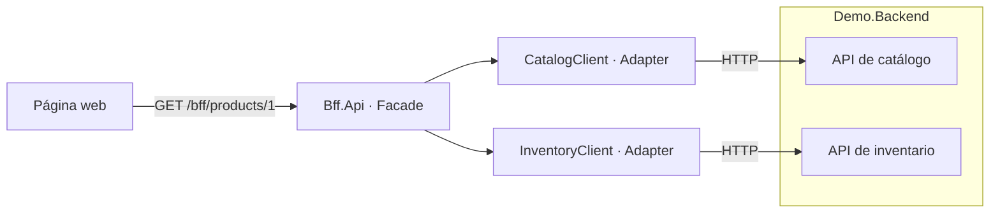

# Ejemplo simple de BFF en .NET 10

Un **Backend for Frontend (BFF)** prepara una API para las necesidades de una interfaz concreta. En este ejemplo, la página web hace una sola petición para obtener nombre, precio y disponibilidad. El BFF consulta catálogo e inventario por HTTP y transforma las respuestas al modelo de la pantalla.

## Arquitectura



Las dos APIs simuladas viven en `Demo.Backend` para ejecutar el ejemplo con solo dos procesos. Sus URLs se configuran por separado: puedes sustituirlas por servicios reales sin cambiar la fachada. Los dos proyectos no se referencian entre sí; se comunican por HTTP.

## Ejecutar

Requisito: SDK de .NET 10. No requiere base de datos ni paquetes NuGet adicionales. `NuGet.Config` permite restaurar usando solo el SDK instalado, sin fuentes externas. Si agregas paquetes en el futuro, tendrás que configurar una fuente NuGet.

Desde la carpeta raíz, compila:

```powershell
dotnet restore BffExample.slnx --configfile NuGet.Config
dotnet build BffExample.slnx --no-restore
```

En una terminal, inicia las APIs simuladas:

```powershell
dotnet run --project src/Demo.Backend --launch-profile http --no-restore
```

En otra terminal, inicia el BFF:

```powershell
dotnet run --project src/Bff.Api --launch-profile http --no-restore
```

Abre [la página de productos](http://localhost:5100). El backend escucha en `http://localhost:5101`. Detén cada proceso con `Ctrl+C`.

## Patrones utilizados

| Patrón o técnica | Archivo | Función |
| --- | --- | --- |
| BFF | `Bff.Api` | Ofrece un contrato específico para esta pantalla web. |
| Facade | `Services/ProductPageService.cs` | Oculta la coordinación entre catálogo e inventario detrás de `GetAsync`. |
| Adapter | `Clients/CatalogClient.cs`, `Clients/InventoryClient.cs` | Convierte las APIs HTTP externas en interfaces C# para la fachada. |
| Agregación | `Services/ProductPageService.cs` | Ejecuta dos consultas en paralelo y compone una sola respuesta. |
| Inyección de dependencias | `Program.cs` | Conecta interfaces y clientes tipados gestionados por `IHttpClientFactory`. |
| DTO | `Models/ProductPageDto.cs` | Separa el contrato de la pantalla de los modelos internos de los backends. |

Para seguir el código, empieza por `ProductEndpoints`, continúa con `ProductPageService` y revisa los dos clientes HTTP. Las interfaces permiten sustituir los clientes por dobles en pruebas.

Cada clase, interfaz y `record` está en un archivo con su mismo nombre. Los `using` explícitos se declaran después del `namespace`, incluidos los dos `Program.cs`. Los modelos del backend están en `Demo.Backend/Models`.

Los archivos se agrupan por función en carpetas comunes:

```text
src/
├── Bff.Api/
│   ├── Clients/           # Adaptadores HTTP
│   ├── Configuration/     # Opciones de conexión
│   ├── Endpoints/         # Rutas del BFF
│   ├── ExceptionHandlers/ # Tratamiento de errores
│   ├── Interfaces/        # Contratos de clientes y servicios
│   ├── Models/            # Records y DTO
│   ├── Services/          # Fachada y agregación
│   ├── wwwroot/           # Página web
│   └── Program.cs
└── Demo.Backend/
    ├── Endpoints/         # APIs simuladas
    ├── Models/            # Records del backend
    └── Program.cs
```

La fachada adapta datos para la presentación; el catálogo conserva el precio y el inventario conserva las existencias. `CanBuy` indica disponibilidad visual en esta demo, no autoriza una compra ni reserva stock. `SupplierCost` es un dato interno simulado: llega desde catálogo, pero no se publica en el BFF.

## Probar la API

```powershell
Invoke-RestMethod http://localhost:5100/bff/products/1
```

Respuesta:

```json
{
  "id": 1,
  "name": "Portátil",
  "description": "Portátil de 14 pulgadas para trabajar y estudiar.",
  "price": 899.90,
  "displayPrice": "899,90 EUR",
  "availability": "Disponible",
  "canBuy": true
}
```

| Petición o situación | Resultado |
| --- | --- |
| `/bff/products/1` | 200, disponible. |
| `/bff/products/2` | 200, agotado; `canBuy` es `false`. |
| `/bff/products/999` | 404, producto inexistente. |
| `/bff/products/0` | 400, identificador inválido. |
| Backend detenido o respuesta inválida | 502. |
| Backend tarda más de 3 segundos | 504. |

Los errores usan `ProblemDetails`. Los detalles técnicos se registran en el servidor. La cancelación de la petición se propaga a las llamadas HTTP. La respuesta requiere las dos fuentes: si alguna falla, no se devuelve una ficha parcial, incluso si la otra devuelve un 404.

`/health` confirma que cada proceso responde; no comprueba sus dependencias.

## Verificación automática

```powershell
powershell -NoProfile -ExecutionPolicy Bypass -File ./scripts/smoke-test.ps1
```

El script compila, inicia procesos temporales en los puertos 5180 y 5181, comprueba la agregación, la exclusión de datos internos, los errores 400/404, la página HTML y el 502 al detener su backend. Finalmente detiene los procesos que ha creado. Los puertos se pueden cambiar con `-BffPort` y `-BackendPort`. La prueba no cubre el timeout 504 ni ejecuta JavaScript en un navegador.

## Configuración y alcance

Las direcciones están en `src/Bff.Api/appsettings.json`, sección `Backends`, y deben terminar en `/`. Puedes sobrescribirlas mediante variables de entorno:

```powershell
$env:Backends__CatalogBaseUrl = "http://localhost:5101/"
$env:Backends__InventoryBaseUrl = "http://localhost:5101/"
```

Ejemplo didáctico con datos en memoria y HTTP local. No incluye autenticación, compras ni persistencia. Para un despliegue real habría que incorporar HTTPS y seguridad según el tipo de cliente. Se mantiene una sola API de BFF organizada por carpetas para que los patrones sean fáciles de seguir.

Referencias oficiales: [patrón BFF](https://learn.microsoft.com/es-es/azure/architecture/patterns/backends-for-frontends) y [clientes HTTP con IHttpClientFactory](https://learn.microsoft.com/en-us/dotnet/core/extensions/httpclient-factory).
